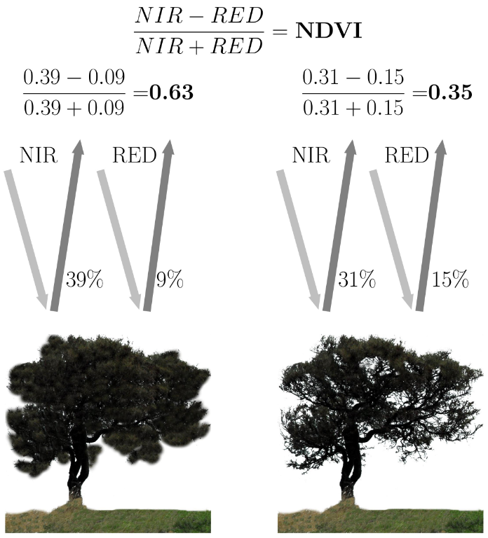

# 05 - Remote sensing for ecosystem
Satellite images can indeed be represented as matrices of numbers. Each pixel in a satellite image corresponds to a specific location on the Earth's surface, and the **color or intensity of that pixel** can be **represented by numerical values**. These numerical values typically represent **attributes such as brightness, reflectance, or temperature**.

A satellite image is usually composed of multiple bands or channels, each capturing data at a specific wavelength. For example, satellite sensors might capture data in the visible spectrum (red, green, blue), as well as in other parts of the electromagnetic spectrum such as infrared or thermal bands. **Each band contributes to a separate layer or "band" in the image**.

To represent a satellite image as a matrix of numbers, each pixel in the image is assigned a numerical value for each band. Therefore, the image can be represented as a three-dimensional matrix, with dimensions corresponding to the image width, image height, and the number of bands.
Each element of the matrix would contain the numerical value corresponding to the intensity or color of the pixel at that location and in that band.

## VEGETATION INDECES

Vegetation index **quantifies the concentration of the green leaf vegetation** around the globe, by carefully measuring the **wavelenghts and intensity of visible and near-infrared light reflected** by land surface back up into space.
By combining daily vegetation indices into 8-, 16-, or 30- day composites, scientists create detailed maps of Earth's green vegetation density, and therefore understand where plants are thriving and where they are under stress.

**Normalized Difference Vegetation Index (NDVI)**

To determine the density of green on a patch land, we must observe the distinct colors (wavelenghts) of visible and NIR sunlight reflected by the plants. **Chlorophyll strongly absorbs visible light (400-700 nm)** for use in photosynthesis. The **cell structure of the leaves strongly reflects NIR (700-1100 nm)** light.
The more leaves a plant has, the more these wavelenght are affected.

If there is much more reflected radiation in NIR wavelenghts than in visible (VIS) wavelenghts, then the vegetation in that pixel is likely to be dense and may contain some type of forest. If there is little difference in the intensity of visible and near-infrared wavelenghts reflected, the vegetation is probably sparse and may consist of grass land, tundra or desert. 

To quantify the density of plant growth on Earth, we use the NDVI = (NIR - VIS)/(NIR + VIS).

NDVI for a given pixel always result in a number that ranges between [-1, +1], however no green leaves gives a value close to zero.
+ 0 = no vegetation
+ close to +1 (0.8-0.9) = highest possible density of green leaves.
