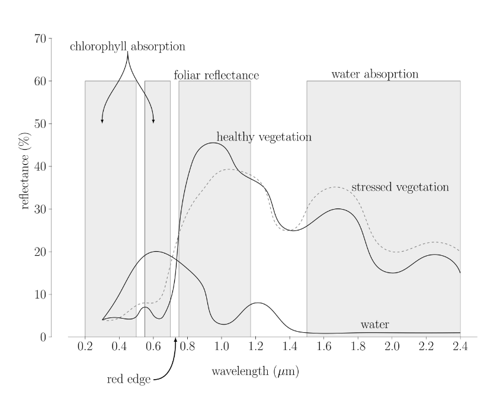

# 05 - Remote sensing for ecosystem
Satellite images can indeed be represented as matrices of numbers. Each pixel in a satellite image corresponds to a specific location on the Earth's surface, and the **color or intensity of that pixel** can be **represented by numerical values**. These numerical values typically represent **attributes such as brightness, reflectance, or temperature**.

A satellite image is usually composed of multiple bands or channels, each capturing data at a specific wavelength. For example, satellite sensors might capture data in the visible spectrum (red, green, blue), as well as in other parts of the electromagnetic spectrum such as infrared or thermal bands. **Each band contributes to a separate layer or "band" in the image**.

To represent a satellite image as a matrix of numbers, each pixel in the image is assigned a numerical value for each band. Therefore, the image can be represented as a three-dimensional matrix, with dimensions corresponding to the image width, image height, and the number of bands.
Each element of the matrix would contain the numerical value corresponding to the intensity or color of the pixel at that location and in that band.

## VEGETATION INDECES

Vegetation index **quantifies the concentration of the green leaf vegetation** around the globe, by carefully measuring the **wavelenghts and intensity of visible and near-infrared light reflected** by land surface back up into space.
By combining daily vegetation indices into 8-, 16-, or 30- day composites, scientists create detailed maps of Earth's green vegetation density, and therefore understand where plants are thriving and where they are under stress.

> **Normalized Difference Vegetation Index (NDVI)**

To determine the density of green on a patch land, we must observe the distinct colors (wavelenghts) of visible and NIR sunlight reflected by the plants. **Chlorophyll strongly absorbs visible light (400-700 nm)** for use in photosynthesis. The **cell structure of the leaves strongly reflects NIR (700-1100 nm)** light.
The more leaves a plant has, the more these wavelenght are affected.

If there is much more reflected radiation in NIR wavelenghts than in visible (red) wavelenghts, then the vegetation in that pixel is likely to be dense and may contain some type of forest. If there is little difference in the intensity of visible and near-infrared wavelenghts reflected, the vegetation is probably sparse and may consist of grass land, tundra or desert. 

To quantify the density of plant growth on Earth, we use the NDVI = (NIR - R)/(NIR + R).

The Normalized Difference Vegetation Index (**NDVI**) is a commonly used vegetation index in remote sensing and satellite imagery analysis. It's a **quantitative indicator of green vegetation or biomass content in an area**. NDVI is calculated from the **reflectance of the Earth's surface in the near-infrared (NIR) and red (R) wavelengths**.

* NIR is the reflectance in the near-infrared band.
* R is the reflectance in the red band (visible).

NDVI values typically range from -1 to 1, where:

+ Values close to 1 indicate dense, healthy vegetation.
+ Values close to 0 indicate little or no vegetation.
+ Values close to -1 may represent water bodies or non-vegetated surfaces.

NDVI values provide information about the density and health of vegetation cover in an area. Higher values generally indicate healthier vegetation, while lower values suggest sparse or stressed vegetation, bare soil, or other non-vegetated surfaces.

## From the code _05.spectral.indices.R_
> a tree is reflecting a lot in the NIR and absorbing a lot in the RED.
>
> DVI = DIFFERENCE VEGETATION INDEX ----> you make the difference between the total bits and the REDs (ex. 255-10 = 245 is the DVI of a living plant)

**DVI = difference between NIR and RED**

> you can standardize the DVI: NORMALIZATION in order to compare data
> 
> + DVI = NIR - RED
> + NDVI = (NIR - RED)/(NIR+RED)
>
> in this way the ranges of the indexes are the same: the NDVI is always ranging from -1 =(0-255)/(0+255) to +1 =(255-0)/(255+0), while the DVI's range depends on the amount of data I have.
>
> the calculation is done pixel by pixel

# 09 - Classification
Grouping pixels can be used to represent the final class on a graph with red, infrared and so on on the axes.

Vegetation area are reflective a lot in the infrared area (not in the red since they are doing photosynthesis). Water absorbs all the infrared light and may reflect red.
These pixels are called TRAINING SITES, something that can explain to the software which clusters (or classes) are present.

If we want **to classify a pixel**, without knowing its class, we must **use the reflectance of the pixel**, and use the SMALLEST DISTANCE FROM THE NEAREST CLASS, to estimate to which class the pixel is most probable to be part of. In this way we can classify every pixel in the image by class.
